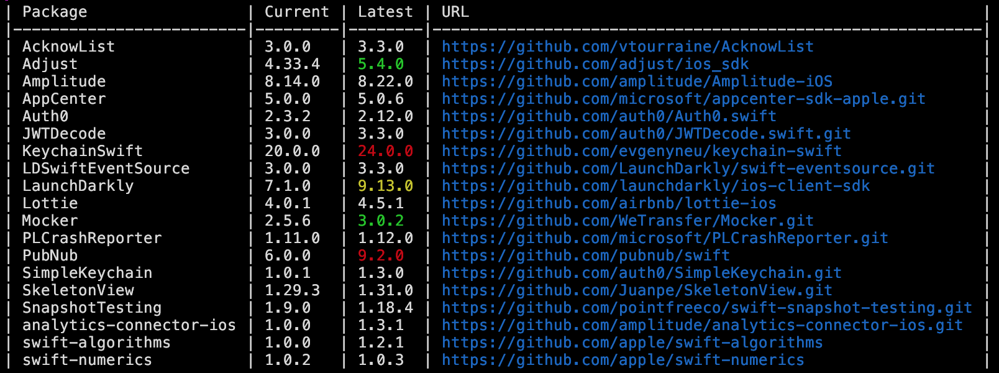

# Are you keeping up with 3rd party dependencies?

In the world of app development, time is never standing still. Even if your project doesn't change much, the world around it is constantly evolving. Not ony operating sytems and compilers change, but also libraries receive updates - sometimes even critical security updates - that should be
applied rather sooner than later to protect your customer's data.

Most projects depend on some 3rd party dependencies for example to simplify networking, to enable user tracking or just by incorporating [a beautiful
UI component](https://github.com/benrudhart/AppleEffortScorePicker) that doesn't need to be written from scratch. How can you keep track of all these udates?

Fortunately, for SPM-based projects there is a tool called [swift-outdated](https://github.com/kiliankoe/swift-outdated) that can assist you.

Install it via homebrew:

```bash
brew install swift-outdated
```

In your project directory, run it as follows to check your dependencies:

```bash
swift-outdated
```

This will show you a table such as this



and list all your outdated dependencies, the currently resolved version and the latest version available in their upstream repository.

It's a good practice to check the outdated dependencies from time to time, by clicking the link and going through the changesets.
